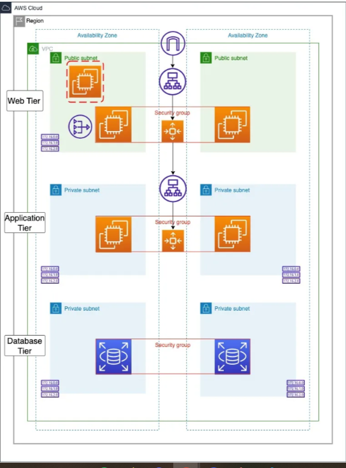
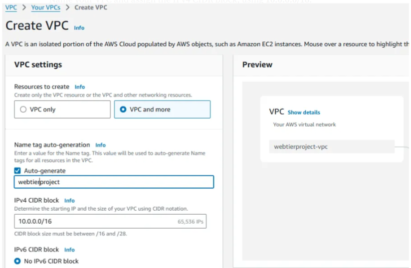
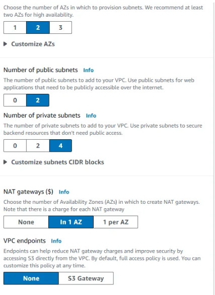
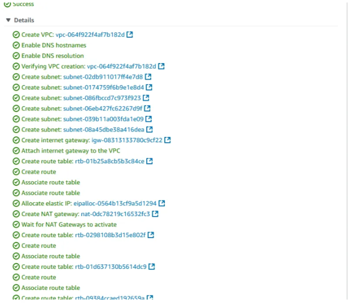
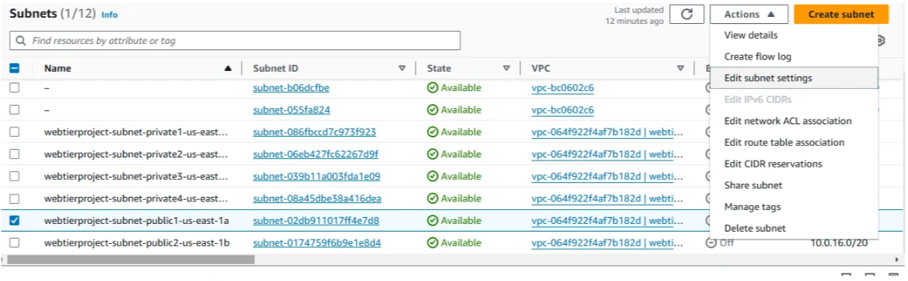
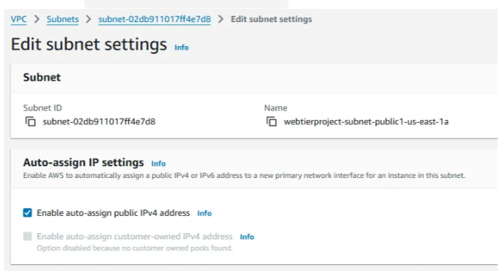

# AWS-Building-a-3-Tier-Architecture
Build a 3-tier architecture on AWS by setting up a web layer (EC2 or ALB), an application layer (EC2, ECS, or Lambda), and a database layer (RDS or DynamoDB), each in separate subnets for security and scalability. Use VPC, security groups, and load balancers to manage traffic and isolation.
### **Introduction**
When building a cloud-based application, it’s vital to consider three key aspects of the architecture:

1. Scalability: How easily the app can scale up or down without frequent manual intervention.
2. Availability: The app’s ability to remain operational over long periods and withstand failures in individual components.
3. Security: Protecting the app from vulnerabilities, managing permissions, and ensuring one compromised part doesn’t affect the whole system.
These factors ensure the application is robust, efficient, and secure.

By addressing these considerations, you can ensure that your cloud-based application is robust, scalable, and secure, setting a strong foundation for long-term success.
In this article, we’ll explore how to build a 3-tier architecture on AWS, a common design pattern that divides applications into three layers:

1. Web/Presentation Tier: Houses the user-facing elements of the application, such as web servers and the interface/front-end.
2. Application Tier: Houses the backend and application source code needed to process data and run functions.
3. Data Tier: Houses and manages the application data. Often where the databases are stored.

### **Prerequisites**
AWS account
Access to Command-line Interface (CLI)
### **Use Case**
As a Cloud Engineer at XXX LTD, you’ve been tasked with designing and implementing a highly available 3-tier architecture for the company’s new web application. The architecture will consist of:

1. Web Server: Handles incoming requests from customers.
2. Application Server: Processes the requests, retrieves data from the database, and performs necessary business logic.
3. Database Server: Stores product and customer information.
By separating the architecture into distinct tiers, XXX LTD can independently scale each component, ensuring better workload management, increased reliability, improved security, and optimized costs.

Remember to delete all (ASG, ALB, DB, NAT Gateway)resources configured to avoid being charged extra.

### **Stage 1: Build Our VPC**
Configure the VPC and other network services. Go to the VPC dashboard and click “Create VPC.” Choose the “VPC and more” option to configure the VPC, subnets, and other networking services simultaneously.

Name your VPC and assign the IPv4 CIDR block, using 10.0.0.0/16.
  

We’ll select two Availability Zones (AZs) for high availability, hosting our subnets. Two public subnets will be used for the web tier (with public access), and four private subnets will secure the backend. Of these, two will be for the application tier and two for the database tier.

Click “Create VPC” and wait for all resources to be created.

You’ll notice that multiple network resources are set up to properly configure the VPC according to our specifications. AWS automates this process for us and we can create them manually too.

Go to “Subnets” in the VPC dashboard’s left pane and confirm that all 6 subnets are created. Next, we need to configure each public subnet to automatically assign a public IPv4 address, enabling internet access.

To do this, select a public subnet, click “Actions” in the top-right corner, and then choose “Edit subnet settings.”

Check the “Enable auto-assign public IPv4 address” box.

Remember to repeat the process for the second public subnet.

Now we move to the next stage of building our web tier.

### **Stage 2: Create the Web Tier**
Go to the EC2 dashboard, then navigate to “Auto Scaling Groups” on the left-hand menu and click “Create Auto Scaling Group.” Provide a name for your ASG and choose “Create a launch template.” This template will contain the necessary configurations for launching EC2 instances that will be publicly accessible.