# AWS-Building-a-3-Tier-Architecture
Build a 3-tier architecture on AWS by setting up a web layer (EC2 or ALB), an application layer (EC2, ECS, or Lambda), and a database layer (RDS or DynamoDB), each in separate subnets for security and scalability. Use VPC, security groups, and load balancers to manage traffic and isolation.
### **Introduction**
When building a cloud-based application, it’s vital to consider three key aspects of the architecture:

1. Scalability: How easily the app can scale up or down without frequent manual intervention.
2. Availability: The app’s ability to remain operational over long periods and withstand failures in individual components.
3. Security: Protecting the app from vulnerabilities, managing permissions, and ensuring one compromised part doesn’t affect the whole system.
These factors ensure the application is robust, efficient, and secure.

By addressing these considerations, you can ensure that your cloud-based application is robust, scalable, and secure, setting a strong foundation for long-term success.
In this article, we’ll explore how to build a 3-tier architecture on AWS, a common design pattern that divides applications into three layers:

1. Web/Presentation Tier: Houses the user-facing elements of the application, such as web servers and the interface/front-end.
2. Application Tier: Houses the backend and application source code needed to process data and run functions.
3. Data Tier: Houses and manages the application data. Often where the databases are stored.

### **Prerequisites**
AWS account
Access to Command-line Interface (CLI)
### **Use Case**
As a Cloud Engineer at XXX LTD, you’ve been tasked with designing and implementing a highly available 3-tier architecture for the company’s new web application. The architecture will consist of:

1. Web Server: Handles incoming requests from customers.
2. Application Server: Processes the requests, retrieves data from the database, and performs necessary business logic.
3. Database Server: Stores product and customer information.
By separating the architecture into distinct tiers, XXX LTD can independently scale each component, ensuring better workload management, increased reliability, improved security, and optimized costs.

Remember to delete all (ASG, ALB, DB, NAT Gateway)resources configured to avoid being charged extra.

### **Stage 1: Build Our VPC**
Configure the VPC and other network services. Go to the VPC dashboard and click “Create VPC.” Choose the “VPC and more” option to configure the VPC, subnets, and other networking services simultaneously.

Name your VPC and assign the IPv4 CIDR block, using 10.0.0.0/16.
  

We’ll select two Availability Zones (AZs) for high availability, hosting our subnets. Two public subnets will be used for the web tier (with public access), and four private subnets will secure the backend. Of these, two will be for the application tier and two for the database tier.

Click “Create VPC” and wait for all resources to be created.

You’ll notice that multiple network resources are set up to properly configure the VPC according to our specifications. AWS automates this process for us and we can create them manually too.

Go to “Subnets” in the VPC dashboard’s left pane and confirm that all 6 subnets are created. Next, we need to configure each public subnet to automatically assign a public IPv4 address, enabling internet access.

To do this, select a public subnet, click “Actions” in the top-right corner, and then choose “Edit subnet settings.”

Check the “Enable auto-assign public IPv4 address” box.

Remember to repeat the process for the second public subnet.

Now we move to the next stage of building our web tier.

### **Stage 2: Create the Web Tier**
Go to the EC2 dashboard, then navigate to “Auto Scaling Groups” on the left-hand menu and click “Create Auto Scaling Group.” Provide a name for your ASG and choose “Create a launch template.” This template will contain the necessary configurations for launching EC2 instances that will be publicly accessible.
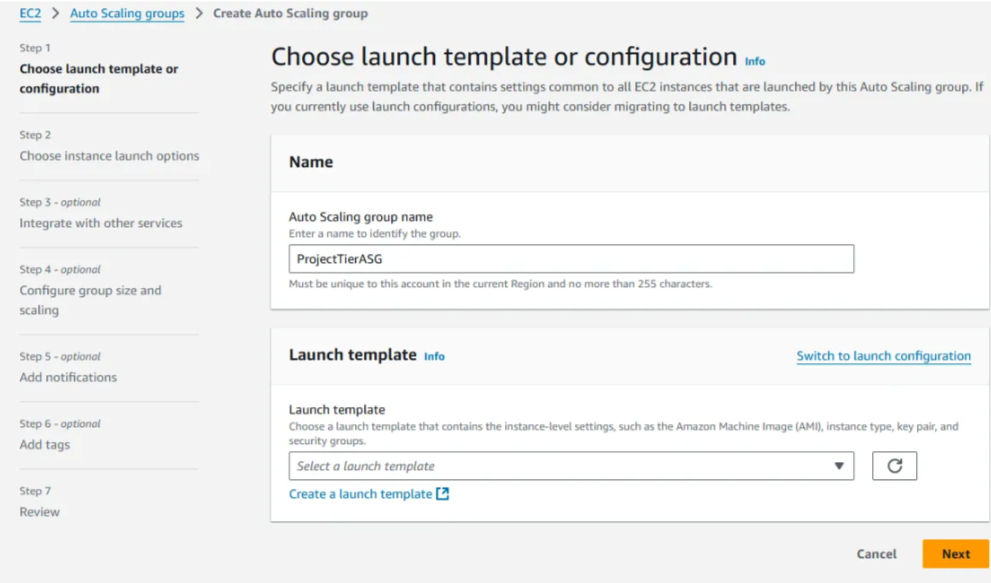

When the launch template window opens, start by naming the template. Then, select the “Amazon Linux 2 AMI” and choose the “t2.micro” instance type.

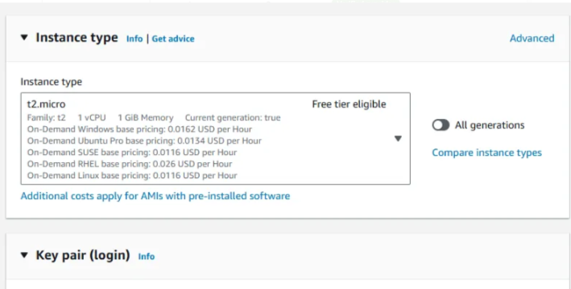
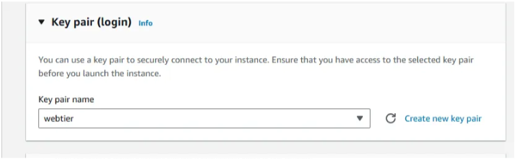

choose an existing key pair or create a new a key pair, then create a new Security Group. Name your security group and make sure to select your previously created VPC.
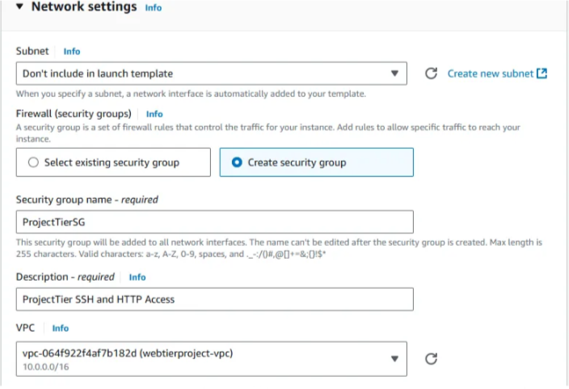
Configure your inbound rules to allow SSH, HTTP, and HTTPS access to our public-facing EC2 Instances from anywhere.
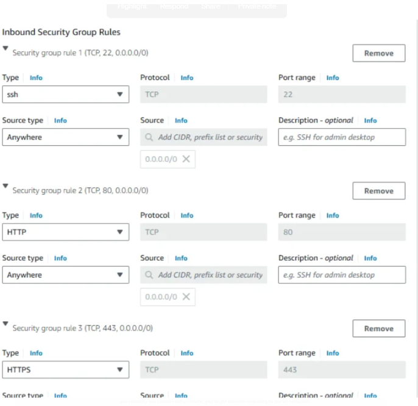
Other options will be left as default, go down to “Advanced details”. copy and paste the following script in the “User data” field, then click “Create launch template”.

#!/bin/bash

#Update all yum package repositories
yum update -y

#Install Apache Web Server
yum install -y httpd.x86_64

#Start and Enable Apache Web Server
systemctl start httpd.service
systemctl enable httpd.service

#Adds our custom webpage html code to "index.html" file.
echo "<html><body><h1>Welcome to my project!</h1></body><html>" > /var/www/html/index.html

After creating the Launch Template, head back to the ASG window, select the launch template just created, then click “Next”.
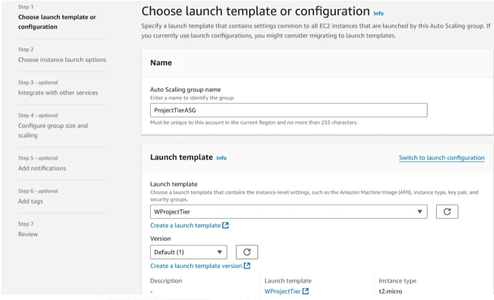
For the “Network” settings, choose your VPC, select the 2 public Availability Zones in your network, and then click “Next”.
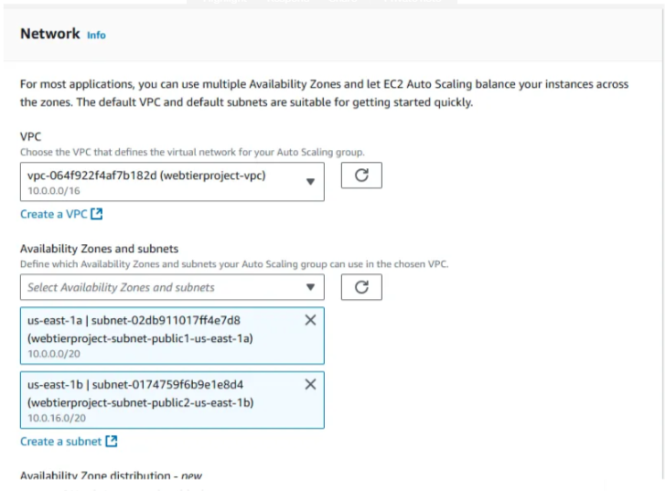
We’ll set up a load balancer to distribute incoming Web Tier traffic across our EC2 instances, enhancing availability.

Choose “Attach to a new load balancer” and select “Application Load Balancer.” Give your load balancer a name, then select “Internet-facing.”

Make sure your VPC and both public subnets are selected.
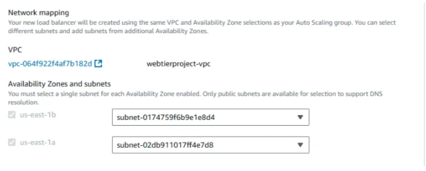

For “Listeners and routing”, select “Create a target group”, then select our new load balancer.
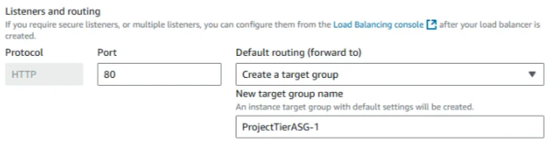

“Enable group metrics collection within CloudWatch” to allow the collection of information of our ASG, then click “Next”.

For the “Configure group size and scaling policies” section, choose 2 for desired capacity, 2 for minimum capacity, and 5 for maximum capacity.

For Scaling policies, choose “Target scaling policy”, ensure the Metric type is “Average CPU utilization”, and set the Target value to 50. Click “Next” to continue.
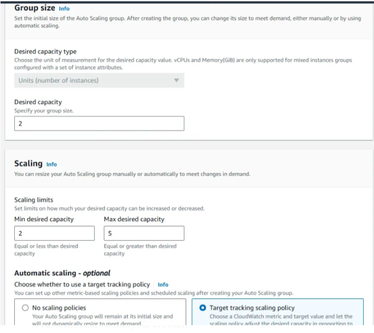

Continue clicking “Next” until you reach the “Review” page. Scroll down and click “Create Auto Scaling Group”.

Your Web Tier’s Auto Scaling Group will now be created. Wait a few minutes for it to initialize and launch the new EC2 Instances.

To verify:

Navigate to the EC2 Instances section in the EC2 dashboard.
Confirm that two EC2 Instances have been launched. Once their state changes to “Running”, copy the public IPv4 address of one instance.
Paste the address into your browser.
You should see your website displayed successfully.
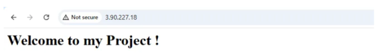

Web Tier has been successfully created.